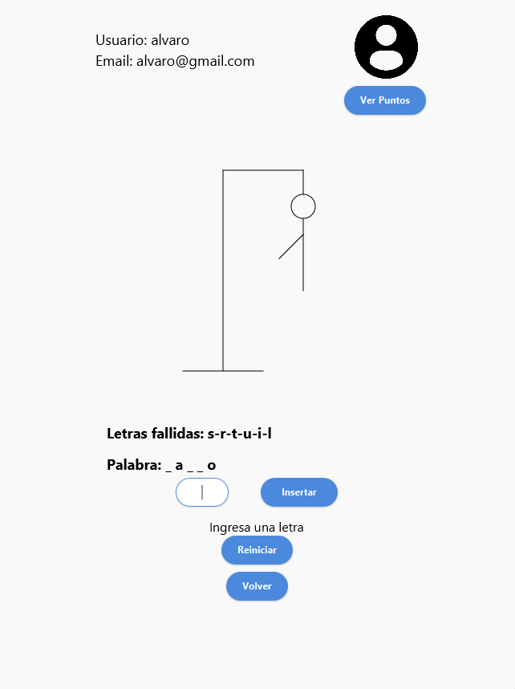
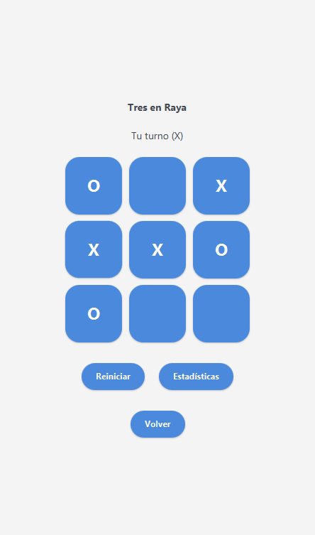

# 🎮 JuegosVarios

## 📝 Descripción
JuegosVarios es una aplicación de escritorio desarrollada en Java con JavaFX, que integra un sistema de gestión de usuarios junto a dos juegos clásicos: el Ahorcado y el Tres en Raya (Tic Tac Toe). Todo el entorno cuenta con una interfaz moderna y estilizada mediante CSS, y la aplicación está conectada a una base de datos que gestiona tanto los usuarios como las estadísticas de cada juego.

## 🎯 Características Principales

### 👤 Sistema de Usuarios

* Registro de nuevos usuarios
* Inicio de sesión seguro
* Recuperación de contraseña
* Edición de perfil
* Eliminación de cuenta

### 🎮 Juegos Incluidos

#### 🪢 Ahorcado

* Palabras aleatorias por nivel (Fácil, Medio, Difícil)
* Máximo de 9 intentos
* Interfaz intuitiva
* Estadísticas individuales

#### ❌⭕ Tres en Raya (Tic Tac Toe)

* Modo jugador contra IA
* Diseño limpio y minimalista
* Registro de partidas ganadas/perdidas

### 📊 Sistema de Estadísticas
* Registro persistente de partidas
* Rachas de victorias
* Nivel y progreso por juego
* Visualización dentro de la interfaz

## 💾 Base de Datos
Sistema SQLite embebido que almacena:
* Información de usuarios
* Estadísticas de cada juego
* Palabras por dificultad para el Ahorcado

## 🎨 Interfaz Gráfica
* Estilizada con CSS minimalista
* Animaciones y efectos visuales suaves
* Experiencia de usuario consistente

## 🛠️ Tecnologías Utilizadas
* 
* 
* 
* 

## 🌍 Idiomas Disponibles
* 🇪🇸 Español
* 🇬🇧 Inglés (en desarrollo)
* 🇫🇷 Francés (en desarrollo)

## 📁 Estructura del Proyecto
```
juegos/
├── src/
│   ├── main/
│   │   ├── java/
│   │   │   ├── module-info.java                  # Módulo principal del proyecto
│   │   │   └── es/
│   │   │       └── ies/
│   │   │           └── puerto/
│   │   │               ├── controller/           # Controladores para la interfaz JavaFX
│   │   │               ├── model/                # Entidades y lógica de negocio
│   │   │               ├── dao/                  # Acceso y gestión de datos (base de datos)
│   │   │               └── util/                 # Clases utilitarias y helpers
│   │   └── resources/
│   │       ├── app-tables.sql                    # Script para crear las tablas de la base de datos
│   │       ├── idioma-en.properties              # Traducción al inglés
│   │       ├── idioma-es.properties              # Traducción al español
│   │       ├── idioma-fr.properties              # Traducción al francés
│   │       ├── usuarios.db                       # Archivo de base de datos SQLite
│   │       ├── es/
│   │       │   └── ies/
│   │       │       └── puerto/
│   │       │           ├── login.fxml            # Vista de inicio de sesión
│   │       │           ├── registro.fxml         # Vista de registro de usuarios
│   │       │           ├── perfil.fxml           # Vista del perfil de usuario
│   │       │           ├── jugar.fxml            # Vista general de selección de juego
│   │       │           ├── tictactoe.fxml        # Vista del juego Tres en Raya
│   │       │           └── styles.css            # Hoja de estilos CSS para la interfaz
│   │       └── images/
│   │           ├── perfil.png                    # Imagen usada para el perfil
│   │           └── pantalla-inicio.png           # Imagen de la pantalla de bienvenida
└── pom.xml                                        # Archivo de configuración del proyecto Maven
```

## ✍️ Autor
* [Álvaro García López](https://github.com/alvarogrlp)

---
⭐ Si te gusta este proyecto, ¡no dudes en darle una estrella!

